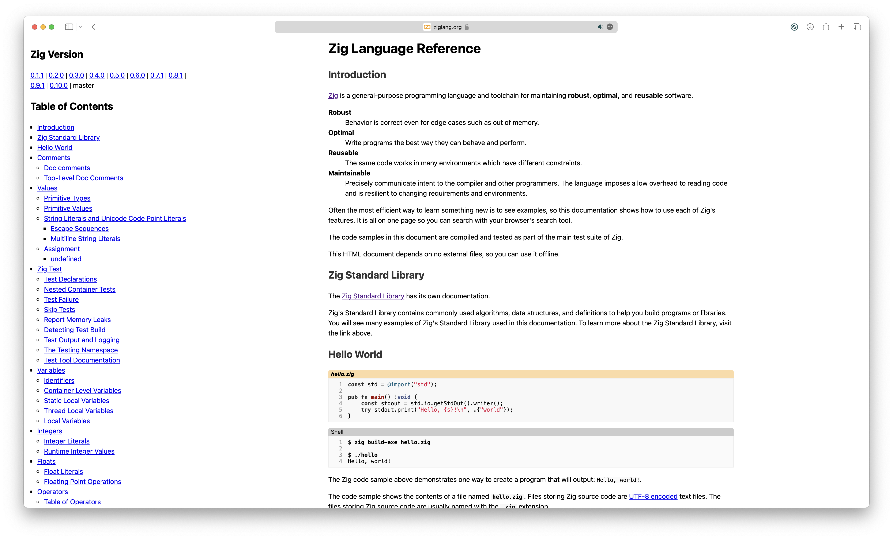

# Unofficial zig docs

> **Warning**
> 
> Website is in development, wait until release!

This repo contains code of [fumine's implementation zig language documentation](https://zig.fumine.ru).
Main reason why we started this is a little bit unreadable design and non-friendly docs.
Some of the points like difference between `pub` and `export` are appearing only in issues
discussions and not in the docs.

We trying to make Zig learning as much frendlier, as it possible. Problem that we find out is that
already learned person hardlier explains features of languages. So, while our pain is fresh, we trying
to give newbye chance to avoid it.

Are we trying to replace existing once? If we done this work succsefully, we would like to give this
project in hands of primary developers. Good work is done by persons who knows their work good.
So lets give the creators of language take care about new good features and We will deliver them in
simple, understandable docs.

    
    <i>Old version of docs</i>

## Planned features

1. [ ] Full step-by-step tutorial to start programming in zig.
2. [ ] Newbye tutorial to start programming in Zig.
3. [ ] Fully documented Standart Libraries.
4. [ ] Tooling overview.
5. [ ] Live display CI/CD of Zig core repository and other, importand projects.
6. [ ] Online code REPL for fast exchaning with code.
7. [ ] Blog transfer from Andrew twitter, Zig discords and official blog part in Zig website.
8. [ ] (This waits until decion on package manager) centralized packages view.

## References

While we rewriting origins, we looking for something like:

* [Tutorial like go](https://gobyexample.com)
* [Learning with JS like style](https://www.solidjs.com/tutorial/introduction_basics)
* [Sharing code with svelte REPLs](https://svelte.dev/repl/hello-world)
* [Clear docs like python](https://docs.python.org/3.11/library/index.html)

Problem here is that everybody of them by our opinion are not going quite well. Like python's
docs are not showing total picture and propably we will be redesigning it with idea of doxygen's
type in head.

## Can I help with it?

If You wish to help us with this project then just rate it with star. Then more people see this repo,
then easier it will be to deliver project to other developers.
